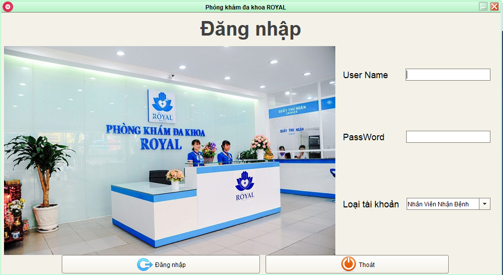

# manageHospital_JavaRMI
Manage Hospital use Java RMI Hibernate 
This is a medical management application at 1 clinic including the basic functions:
  1. Log in to the Gui corresponding to each employee type: doctor, pharmacist, receptionist, manager.
  2. the process from the patient coming to the clinic until receiving the medication: 
  Receiving patients --> medical examination and prescription --> buy medicine.
Login GUI: 

